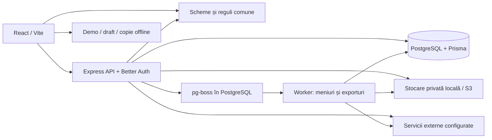

# Whereto

**O călătorie bine organizată, cu un buget clar.** Whereto este o aplicație web pentru planificarea călătoriilor: itinerariu pe zile, cazare, zboruri, rezervări, hartă, cheltuieli și colaborare într-un singur loc.

Acest README inventariază implementarea verificată la **4 octombrie 2026**. Interfața aplicației este în engleză; documentația de față este în română. „Implementat” înseamnă că funcționalitatea există în cod, nu că toate serviciile externe au fost validate în producție.

## Cuprins

- [Stadiul actual](#stadiul-actual)
- [Funcționalități existente](#funcționalități-existente)
- [Reguli de produs](#reguli-de-produs)
- [Arhitectură și tehnologii](#arhitectură-și-tehnologii)
- [Structura proiectului](#structura-proiectului)
- [Modelul de date](#modelul-de-date)
- [Pagini și API](#pagini-și-api)
- [Pornire locală](#pornire-locală)
- [Configurare și integrări](#configurare-și-integrări)
- [Build și deployment](#build-și-deployment)
- [Teste și verificări](#teste-și-verificări)
- [Ce mai trebuie implementat sau finalizat](#ce-mai-trebuie-implementat-sau-finalizat)
- [Documentație detaliată](#documentație-detaliată)

## Stadiul actual

Aplicația are frontend, API, persistență PostgreSQL, autentificare, worker pentru operații de fundal și panou administrativ.

| Mod                  | Ce oferă                                                           | Limitări                                                                                   |
| -------------------- | ------------------------------------------------------------------ | ------------------------------------------------------------------------------------------ |
| Aplicația conectată  | Conturi, călătorii persistente, colaborare, documente și integrări | Necesită API și PostgreSQL; serviciile externe necesită configurare                        |
| Demo `/demo`         | Călătorie exemplu editabilă, cu itinerariu și buget sincronizate   | Date locale în browser; prețuri și hartă ilustrative; fără upload privat sau servicii live |
| Build `presentation` | Landing, demo și pagini de prezentare pentru hosting static        | Conturile, administrarea și serviciile API sunt înlocuite cu o pagină explicativă          |

**Funcționează fără chei pentru servicii externe:** planificarea manuală, conturile cu email local de dezvoltare, bugetele, zborurile introduse/importate local, importul de rezervări și bonuri, sondajele, checklisturile, partajarea, documentele stocate local și administrarea. Aplicația conectată are în continuare nevoie de PostgreSQL și de configurația de bază.

**Au implementare, dar necesită servicii configurate:** hărți și rute reale, exporturile cu hartă, meniurile procesate prin Groq, autentificarea Google, emailurile reale, abonamentele Stripe și stocarea S3. Lipsa unui serviciu este afișată explicit; datele exemplu nu sunt prezentate ca rezultate live.

## Funcționalități existente

### 1. Site de prezentare și experiență vizuală

- Landing cu explicații despre produs, prețuri, întrebări frecvente și exemple interactive.
- Exemplu de itinerariu/hartă/buget sincronizat și demonstrație de import al unei rezervări, urmată de adăugarea transferului.
- Introducere vizuală cu posibilitate de skip, afișată o dată pe sesiunea browserului.
- Identitate pastel, font Nunito local, logo, iconuri, ilustrații și variante SVG animate.
- Navigare desktop și mobil, sidebar compact, controale Radix, dialoguri, notificări și drag-and-drop cu alternativă de tastatură.
- Animații Motion/GSAP, încărcare separată a paginilor și respectarea preferinței de mișcare redusă.
- Titluri și descrieri pe rute, Open Graph/Twitter, imagine socială, `robots.txt`, sitemap condiționat de domeniul configurat și `noindex` pentru pagini private/demo.
- Pagini de prețuri, termeni și confidențialitate; conținutul juridic este încă provizoriu.

### 2. Conturi, securitate și setări

- Înregistrare cu nume, email și parolă; verificarea adresei înainte de folosirea călătoriilor private.
- Login/logout, resetare și schimbare parolă, modificarea profilului și flux de schimbare a emailului.
- Autentificare Google opțională, prin Better Auth.
- Autentificare cu doi factori prin aplicație TOTP și coduri de recuperare.
- Listarea și revocarea sesiunilor; schimbarea parolei din setări revocă celelalte sesiuni.
- Preferințe persistente: monedă, oraș de plecare, vizualizare inițială, navigare compactă, mișcare redusă și ghiduri.
- Situația abonamentului și acces la portalul de facturare, dacă Stripe este configurat.
- Export JSON al profilului, preferințelor și călătoriilor accesibile; documentele se descarcă separat.
- Ștergerea draftului și a copiei offline de pe dispozitiv, plus reluarea tururilor de ajutor.
- În dezvoltare, fără Resend, mesajele de verificare/resetare sunt disponibile într-o cutie poștală locală. Aceasta este dezactivată în producție.

### 3. Crearea și gestionarea călătoriilor

- Dashboard cu căutare și separarea călătoriilor active de cele arhivate.
- Onboarding în patru pași: participanți, destinații/date, buget și confirmare.
- Draft de onboarding salvat local, separat pentru fiecare utilizator; preferințele contului completează valorile inițiale.
- Una sau mai multe destinații, participanți, monedă de bază, buget, oraș de plecare și modulele dorite: itinerariu, buget sau ambele.
- Catalog local de 31 de orașe; căutare extinsă prin Geoapify atunci când este conectat.
- Arhivare și dezarhivare; modificarea setărilor permise și a participanților.
- Sugestii de primii pași pentru o călătorie goală: cazare, transport, activitate sau cheltuială.

### 4. Itinerariu, idei și Today

- Vizualizări pentru itinerariu, idei, buget și ziua curentă.
- Activități, restaurante, cazare, transport, zboruri, cumpărături și alte elemente.
- Stări distincte: idee, planificat și rezervat; dată, oră, durată, locație, note și link de rezervare.
- Adăugare rapidă de activități/cheltuieli și editor complet cu taburi pentru detalii, costuri și plăți.
- Reordonare prin drag-and-drop, tastatură/butoane, sugestie de ordine cu preview și Undo; rezervările fixe rămân ancore.
- Avertizări de suprapuneri și verificări ale perioadei/locației; duratele necunoscute nu sunt inventate.
- Căutare în plan și comparație între două opțiuni, inclusiv costul de grup și orientativ pe persoană.
- Today identifică oprirea în desfășurare, următoarea oprire, planurile fără oră și cazarea curentă; include context înainte/după călătorie.
- Ceasuri locale, acces la rezervare/navigare/documente și adăugare rapidă de cheltuieli.
- Comentarii pe elemente, istoric de modificări și recuperarea elementelor șterse logic.
- Ghiduri integrate: 5 teme pentru dashboard și 25 pentru planner, cu acces direct la instrumentele explicate.

### 5. Buget, plăți și împărțirea cheltuielilor

- Itinerariul și bugetul folosesc aceleași elemente; o rezervare nu este introdusă de două ori pentru a apărea în ambele.
- Linii de cost pe grup, persoană, noapte, cameră, bilet sau produs, cu cantitate și multiplicator.
- Separarea estimărilor de costurile confirmate și a rezervării de confirmarea financiară.
- Plăți, avansuri, rambursări, sume efectiv debitate și termene de plată.
- Conversii valutare cu rata și data salvate; rate Frankfurter când sunt disponibile sau completare manuală.
- Totaluri pe categorii, solduri de plată, supraplăți separate, bani economisiți și rezervă de buget.
- Distribuție între participanți, ponderi personalizate și sugestii de decontare.
- Transferurile de decontare nu adaugă cheltuieli; ideile nu intră în totalurile planificate.
- Calcule cu `decimal.js`, inclusiv împărțirea exactă până la ultimul ban.

### 6. Zboruri și escale

- O rezervare poate avea până la 12 segmente ordonate, cu un singur cost și registru de plăți.
- Căutarea aeroporturilor după cod IATA, nume sau oraș în directorul local cu 7.916 aeroporturi.
- Companie, număr de zbor, aeroporturi, date/ore locale, terminale, porți, referință privată și conexiuni pe bilete separate.
- Durate și escale calculate folosind fusurile orare IANA; gestionarea schimbărilor de oră, a trecerii peste miezul nopții și a liniei de schimbare a datei.
- Import din text lipit, PDF cu text, TXT și EML simplu, procesat în browser; previzualizare înainte de aplicare.
- Zborurile peste noapte apar pe zilele relevante; costul este contabilizat o singură dată.
- Segmentele apar în itinerariu, Today, hartă și legendele exporturilor; referințele private sunt eliminate din ieșirile publice.
- Importul dedicat de zbor nu păstrează fișierul original. Acesta poate fi încărcat separat în Documents.

**Limite:** importul dedicat de zbor acceptă PDF de maximum 5 MB și 10 pagini; scanurile fără text necesită introducere manuală. Nu există căutare automată după numărul zborului sau informații live despre întârzieri/porți.

### 7. Rezervări, transferuri, bonuri și decizii de grup

| Instrument             | Implementare actuală                                                                                                                                 |
| ---------------------- | ---------------------------------------------------------------------------------------------------------------------------------------------------- |
| Import de rezervare    | Hoteluri, trenuri/transport și activități din text, PDF sau imagini; extragere/OCR în browser, verificare în editor și păstrarea originalului privat |
| Protecție la duplicate | Verificarea hashului fișierului, referințelor și titlurilor datate; salvare tranzacțională și control de versiune                                    |
| Transfer aeroport      | Detectarea transferurilor lipsă din zbor și cazare; compararea tren/metrou, autobuz și taxi; estimări manuale sau durate de la servicii configurate  |
| Bon detaliat           | Pornire dintr-o masă existentă, OCR/text, verificarea totalului și alocarea produselor/reducerilor pe participanți                                   |
| Sondaje                | Între 2 și 8 idei de restaurante/activități; câte un vot modificabil per colaborator autentificat; proprietarul confirmă câștigătorul                |
| Bagaje și pregătire    | Checklist și sugestii determinate de durată, zboruri, activități și teme selectate, fără AI sau prognoză meteo                                       |
| Detalii lipsă          | Detectarea nopților fără cazare, transferurilor lipsă, elementelor fără costuri și soldurilor cu scadență apropiată/depășită                         |

Importurile de rezervări/bonuri acceptă PDF, PNG, JPEG, WebP, TXT și EML simplu: maximum 8 MB, 10 pagini PDF și 100.000 de caractere extrase. OCR poate descărca inițial datele necesare; există alternativă de lipire a textului sau completare manuală.

Un total din confirmare nu este tratat ca plată. Un bon actualizează masa existentă și păstrează plățile; nu creează o cheltuială duplicată. Transferurile validate respectă cronologia zborului, iar tariful taxiului rămâne o estimare introdusă de utilizator. Aceste instrumente nu consumă cota de importuri AI pentru meniuri.

### 8. Hărți, descoperire și meniuri

- MapLibre afișează locații, opriri și aeroporturi, cu date cartografice Geoapify atunci când serviciul este disponibil.
- Rute pietonale/auto și comparații de timp prin Geoapify; transport public prin Google Routes, într-o vizualizare separată fără hartă.
- Google Places UI Kit pentru descoperire opțională; conținutul Google nu este copiat în itinerariul persistent.
- GetYourGuide prin linkuri externe de căutare; rezervarea și plata se fac la furnizor. Widgeturile de partener nu sunt activate ca funcționalitate completă.
- Import de meniuri din URL public sau PDF/imagine, cu procesare în worker, extragere text/OCR și Groq pentru structurare/traducere în engleză.
- Păstrarea denumirilor originale, sursei și informațiilor despre preț; prețurile necunoscute necesită confirmare.
- Selectarea preparatelor actualizează o estimare de masă, fără a plasa o comandă.
- Reutilizarea importurilor după hash, cote, retry la limitare și consumarea cotei doar după salvarea reușită.
- Protecții pentru importul URL: blocarea rețelelor interne, verificarea redirecturilor, rezoluție DNS controlată, reguli robots și limite de dimensiune.

### 9. Colaborare, documente, export și offline

- Proprietar și colaboratori editori; invitațiile editorilor cer autentificare.
- Linkuri publice de vizualizare, cu bugetul și cazarea ascunse implicit și posibilitate de revocare.
- Datele publice exclud documentele, identitățile participanților, plățile, notele private, referințele rezervărilor și sondajele.
- Eliminarea colaboratorilor și verificarea permisiunilor în API.
- Sincronizare prin refetch periodic, la aproximativ 30 de secunde, și versiune pe călătorie; salvările concurente depășite sunt respinse cu `409 VERSION_CONFLICT`.
- Documente private PDF/PNG/JPEG/WebP, asociabile rezervărilor; descărcare și ștergere; cotă totală de 100 MB per călătorie.
- Stocare locală în `.data` sau S3 compatibil; descărcarea trece prin verificarea accesului.
- Export PDF/PNG în worker, pentru zi sau călătorie, cu hartă, legendă, date și opțiuni pentru buget/cazare. Exporturile geografice necesită Geoapify.
- Manifest și service worker pentru resursele aplicației; ultima călătorie deschisă poate fi citită din copia locală în lipsa conexiunii.
- Logout șterge copia locală a planului; documentele sunt disponibile offline numai dacă au fost descărcate explicit.

**Limite:** offline este doar pentru citire; nu există sincronizarea modificărilor offline, prezență live sau îmbinare automată a editărilor concurente. Istoricul înregistrează acțiunile, fără a oferi restaurarea integrală a oricărei versiuni vechi a călătoriei.

### 10. Abonamente și administrare

- Stripe Checkout și Customer Portal, verificarea prețului configurat și webhook semnat, cu deduplicarea evenimentelor.
- Sincronizarea abonamentelor, anulării și perioadei plătite; retry/resync administrativ pentru erori.
- Dashboard privat `/admin`: Overview, Users, Trips, Subscriptions, Jobs, Integrations și Activity log.
- Proprietar administrativ identificat prin `ADMIN_OWNER_USER_ID`, cu TOTP și verificare suplimentară legată de sesiune.
- Pentru citire, verificarea admin este valabilă maximum 8 ore; schimbările cer o verificare mai recentă de 10 minute.
- Suspendare/reactivare utilizatori, revocarea sesiunilor și blocarea accesului la călătoriile unui proprietar suspendat.
- Credite bonus pentru călătorii/importuri, acordare și revocarea creditelor nefolosite, cu protecții la repetarea cererilor.
- Vizualizarea joburilor și reîncercarea celor eșuate; joburile active/finalizate nu sunt relansate manual.
- Pauză pe integrări, plafoane de consum, indicatori de utilizare, heartbeat worker și jurnal al intervențiilor.
- Metrici pentru utilizatori, călătorii, abonamente, MRR estimat și pași de onboarding observați efectiv.
- Proiecții admin limitate: fără conținutul privat al planurilor, documentelor sau payloadurilor joburilor.

## Reguli de produs

Acestea sunt regulile și prețurile implementate în cod la data inventarului:

| Regulă                  | Comportament                                                                                                               |
| ----------------------- | -------------------------------------------------------------------------------------------------------------------------- |
| Prima călătorie         | Gratuită o singură dată per cont verificat; arhivarea nu reface dreptul                                                    |
| Călătorii suplimentare  | Abonament activ sau credite bonus acordate de administrator                                                                |
| Abonament               | 5 EUR/lună sau 40 EUR/an                                                                                                   |
| Meniuri gratuite        | 10 importuri reușite pentru prima călătorie, plus eventuale credite bonus                                                  |
| Meniuri Pro             | 30 importuri reușite per perioadă lunară de la aniversarea abonamentului, inclusiv la planul anual; fără report            |
| Expirarea abonamentului | Călătoriile existente rămân editabile/exportabile, în limitele disponibilității serviciilor                                |
| Destinații              | Se aleg înainte de confirmare și nu pot fi schimbate ulterior                                                              |
| Date                    | Se blochează când începe plecarea salvată, în fusul orar al destinației                                                    |
| Locații                 | Elementele care nu sunt transport trebuie să fie la maximum 100 km de o destinație aleasă                                  |
| Limite structurale      | Maximum 20 destinații, 50 participanți, 1.000 elemente și diferență de maximum 365 zile între datele de început și sfârșit |

Un avans reduce soldul de plată, nu costul. O rambursare și o decontare au semnificații distincte. Toate vizualizările folosesc aceleași înregistrări financiare.

## Arhitectură și tehnologii

Monorepo TypeScript cu npm workspaces:

| Strat                 | Tehnologii și rol                                                                            |
| --------------------- | -------------------------------------------------------------------------------------------- |
| Frontend              | React 19, Vite 7, React Router 7, TanStack Query 5                                           |
| Interfață             | CSS/Tailwind 4, Radix UI, Phosphor Icons, Motion, GSAP, dnd-kit, Sonner                      |
| Hartă și import local | MapLibre GL, PDF.js, Tesseract.js                                                            |
| API                   | Node.js 22, Express 5, Zod, Helmet și rate limiting                                          |
| Autentificare         | Better Auth cu adaptor Prisma și plugin TOTP                                                 |
| Date                  | PostgreSQL, Prisma **6.12.0**, stare de călătorie JSON/JSONB și tabele relaționale auxiliare |
| Reguli comune         | `@whereto/shared`, Zod și `decimal.js`                                                       |
| Operații de fundal    | Proces worker separat și `pg-boss`, cu coadă în PostgreSQL; fără Redis                       |
| Export și fișiere     | `pdf-lib`, fontkit, canvas, Sharp și AWS SDK pentru S3                                       |
| Teste                 | Vitest și Playwright                                                                         |
| Deployment            | Docker multi-stage, Compose și Nginx                                                         |

Versiunile exacte ale dependențelor instalabile sunt fixate de `package-lock.json`.



Fluxul principal de salvare: interfața trimite o comandă și versiunea curentă; API-ul verifică sesiunea, permisiunile și regulile comune, aplică schimbarea într-o tranzacție, crește versiunea și înregistrează acțiunea. Pentru meniuri și exporturi, API-ul creează un job, workerul îl procesează, iar interfața verifică rezultatul.

## Structura proiectului

```text
Whereto/
├── apps/
│   ├── web/
│   │   ├── src/
│   │   │   ├── main.tsx                 # Bootstrap, router, providers, service worker
│   │   │   ├── pages/                   # Landing, Auth, Dashboard, Onboarding,
│   │   │   │                            # Planner, Settings, Admin, Share, Pricing,
│   │   │   │                            # Legal, TwoFactor, Presentation
│   │   │   ├── components/              # Editor, buget, hartă, importuri, zboruri,
│   │   │   │                            # sondaje, transferuri, ghiduri, controale
│   │   │   │   ├── react-bits/          # Componente adaptate și licențiate
│   │   │   │   └── archive/             # Experimente/componente vizuale păstrate
│   │   │   ├── lib/                     # Client API/auth, demo, preferințe,
│   │   │   │                            # import fișiere, metadata, deployment
│   │   │   └── styles.css
│   │   ├── public/
│   │   │   ├── brand/                   # Logo, iconuri, SVG/PNG, social preview
│   │   │   ├── data/                    # Director aeroporturi și licența sa
│   │   │   ├── manifest.webmanifest
│   │   │   └── sw.js
│   │   ├── metadata-plugin.ts           # HTML pe rute, robots, sitemap
│   │   ├── vite.config.ts
│   │   └── package.json
│   └── api/
│       ├── src/
│       │   ├── server.ts                # Express, middleware, auth, webhook
│       │   ├── api.ts                   # Călătorii, comenzi, documente, share, jobs
│       │   ├── planning-api.ts          # Import rezervări/bonuri și transferuri
│       │   ├── auth.ts / access.ts      # Autentificare, roluri și drepturi
│       │   ├── admin*.ts                # API admin, reguli și verificare acces
│       │   ├── billing.ts               # Stripe, abonamente și webhook
│       │   ├── providers.ts             # Locații, rute, cote de furnizori
│       │   ├── integrations.ts          # Pauză, plafoane și stare integrări
│       │   ├── storage.ts               # Fișiere private local/S3
│       │   ├── safe-fetch.ts            # Import controlat din URL public
│       │   ├── map-tiles.ts / catalogue.ts
│       │   ├── queue.ts / job-runtime.ts
│       │   ├── worker.ts
│       │   ├── menu-worker.ts / export-worker.ts
│       │   └── config.ts / db.ts
│       ├── prisma/
│       │   ├── schema.prisma
│       │   └── migrations/              # Inițial, reguli trip, admin, preferințe
│       └── package.json
├── packages/shared/src/
│   ├── index.ts                         # Scheme trip, bani, comenzi, Today, share
│   ├── flights.ts / flight-import.ts
│   ├── planning.ts / planning-types.ts
│   ├── reservation-import.ts
│   └── preferences.ts
├── tests/
│   ├── *.test.ts                        # Domeniu, API, admin, conturi, integrări
│   └── browser/*.spec.ts                # Playwright desktop/mobil
├── scripts/                             # DB check, owner, brand, fixtures, verificări
├── docs/                                # Documentație de produs și implementare
├── artifacts/                           # Probe locale generate; neincluse în Git
├── infra/nginx.conf
├── Dockerfile / compose.yaml
├── .env.example / .gitignore / .dockerignore
├── package.json / package-lock.json
├── tsconfig.base.json
├── vitest.config.ts / playwright.config.ts
└── README.md
```

`node_modules/`, `dist/`, `dist-presentation/`, `.data/`, `artifacts/`, fișierele `.env`, rapoartele Playwright și rezultatele testelor sunt locale/generate și sunt excluse prin `.gitignore`. `.env.example` conține numai modelul de configurare. Datele reale din baza locală și fișierele private nu sunt incluse în repository.

## Modelul de date

Schema Prisma definește 24 de modele:

| Domeniu                       | Modele                                                                                    |
| ----------------------------- | ----------------------------------------------------------------------------------------- |
| Identitate                    | `User`, `Session`, `Account`, `Verification`, `TwoFactor`                                 |
| Drepturi și abonamente        | `Entitlement`, `StripeEvent`, `CreditGrant`, `CreditUse`                                  |
| Călătorii și colaborare       | `Trip`, `TripMember`, `TripHistory`, `ShareLink`                                          |
| Fișiere și operații de fundal | `Document`, `Menu`, `Job`, `JobAttempt`, `WorkerHeartbeat`                                |
| Administrare și operare       | `AdminProof`, `AdminAudit`, `IntegrationControl`, `ProviderUsage`, `Milestone`, `DevMail` |

`Trip.state` păstrează documentul validat `TripState`: destinații, participanți, elemente de itinerariu, costuri, plăți, decontări, comentarii, checklist și sondaje. Rezervările, bonurile, transferurile și segmentele de zbor fac parte din elementele acestui document. Fișierele, membrii, linkurile de partajare, joburile și drepturile contului au tabele separate.

`Trip.version` previne suprascrierea unei versiuni mai noi. Dreptul la prima călătorie și consumul creditelor folosesc tranzacții și blocări PostgreSQL; linkurile sunt identificate prin hashuri de token.

## Pagini și API

### Rute frontend

| Rută                                   | Rol                                                     |
| -------------------------------------- | ------------------------------------------------------- |
| `/`                                    | Landing și exemple interactive                          |
| `/demo`                                | Planner cu date exemplu locale                          |
| `/pricing`                             | Planuri, prețuri și acces la checkout                   |
| `/signup`, `/login`, `/reset-password` | Cont și recuperarea accesului                           |
| `/two-factor`                          | Verificare la autentificarea cu doi factori             |
| `/app`                                 | Dashboard călătorii                                     |
| `/app/new`                             | Onboarding pentru călătorie nouă                        |
| `/app/trips/:id`                       | Planner conectat la API                                 |
| `/app/settings`                        | Profil, securitate, preferințe, billing, date și ajutor |
| `/share/:token`                        | Vizualizare publică sanitizată                          |
| `/join/:token`                         | Acceptarea invitației de colaborare                     |
| `/admin/*`                             | Administrare privată                                    |
| `/privacy`, `/terms`                   | Pagini juridice provizorii                              |

Activele de brand sunt fișiere în `/brand/`; routerul actual nu definește o pagină distinctă `/brand`.

### Grupuri principale de endpointuri

Autentificarea este sub `/api/auth/*`, iar API-ul aplicației sub `/api/v1`. Tabelul este o hartă orientativă, nu o specificație OpenAPI completă.

| Grup                 | Endpointuri reprezentative                                                                                                                                                            |
| -------------------- | ------------------------------------------------------------------------------------------------------------------------------------------------------------------------------------- |
| Stare și configurare | `GET /health`, `GET /config`, `GET /dev-mail` numai în dezvoltare                                                                                                                     |
| Cont                 | `GET /me`, `PATCH /me/preferences`                                                                                                                                                    |
| Călătorii            | `GET/POST /trips`, `GET /trips/:id`, `POST /trips/:id/commands`                                                                                                                       |
| Organizare           | `POST /trips/:id/archive`, `GET /trips/:id/history`, `POST /trips/:id/suggest-order`                                                                                                  |
| Planificare          | `POST /trips/:id/planning/import`, `POST /trips/:id/planning/transfers`; sondajele folosesc comenzile trip                                                                            |
| Locații și transport | `GET /places`, `GET /maps/tiles/:z/:x/:y`, `POST /routes`, `POST /transit`, `POST /google-places-session`                                                                             |
| Valută               | `GET /rates`                                                                                                                                                                          |
| Partajare            | `GET/POST /trips/:id/shares`, `DELETE /trips/:id/shares/:linkId`, `GET /share/:token`, `POST /join/:token`                                                                            |
| Membri               | `GET /trips/:id/members`, `DELETE /trips/:id/members/:memberId`                                                                                                                       |
| Documente            | `GET/POST /trips/:id/documents`, `GET /documents/:id/download`, `DELETE /documents/:id`                                                                                               |
| Meniuri              | `GET /trips/:id/menus`, `POST /trips/:id/menus/import`                                                                                                                                |
| Exporturi            | `POST /trips/:id/exports`, `GET /trips/:id/jobs`, `GET /jobs/:id/download`                                                                                                            |
| Billing              | `POST /billing/checkout`, `POST /billing/portal`, `POST /billing/webhook`                                                                                                             |
| Admin                | `/admin/access`, `/admin/overview`, `/admin/users`, `/admin/trips`, `/admin/subscriptions`, `/admin/jobs`, `/admin/integrations`, `/admin/activity`, `/admin/actions/:action/:target` |

## Pornire locală

### Cerințe

- Node.js 22.16+ și npm, conform mediului local verificat.
- PostgreSQL disponibil și o bază de date creată pentru aplicație. Compose furnizează PostgreSQL 18.
- Fișier `.env` în rădăcina proiectului; pornește de la `.env.example`.

```powershell
git clone https://github.com/blueprint-pilif-01/Whereto.git
cd Whereto
npm ci
# Doar la prima configurare, dacă .env nu există deja:
Copy-Item .env.example .env
```

Repository-ul este privat: clonarea necesită un cont GitHub cu acces. Completează `DATABASE_URL`, `APP_URL=http://localhost:5173` și un `BETTER_AUTH_SECRET` aleatoriu de minimum 32 de caractere. Nu suprascrie o configurație existentă. Apoi:

```powershell
npm run db:generate
npm run db:migrate
npm run db:check
npm run dev
```

- Frontend: `http://localhost:5173`.
- API: `http://localhost:3001/api/v1/health`.
- `npm run dev` pornește frontendul, API-ul și workerul de meniuri/exporturi.
- Folosește aceeași origine ca în `APP_URL`; nu alterna între `localhost` și `127.0.0.1` în browser pentru autentificare.
- Migrările se aplică prin `migrate deploy`; nu folosi `prisma migrate reset` pe date pe care vrei să le păstrezi.
- Fără Resend, folosește adrese fictive la testare și mesajele din cutia poștală locală.

### Comenzi disponibile

| Comandă                                      | Scop                                                     |
| -------------------------------------------- | -------------------------------------------------------- |
| `npm run dev`                                | Frontend + API + worker în dezvoltare                    |
| `npm run build`                              | Build shared, API și frontend                            |
| `npm run typecheck`                          | Verificare TypeScript în toate workspace-urile           |
| `npm test`                                   | Toate testele Vitest; unele necesită DB/API              |
| `npm run test:e2e`                           | Playwright; aplicația trebuie pornită separat            |
| `npm run db:generate`                        | Generare client Prisma                                   |
| `npm run db:migrate`                         | Aplicarea migrărilor existente                           |
| `npm run db:check`                           | Verificarea conexiunii PostgreSQL                        |
| `npm run admin:owner -- owner@example.com`   | Configurarea unui cont verificat existent ca owner admin |
| `npm run brand:build`                        | Generarea activelor de brand                             |
| `npm run build:presentation -w @whereto/web` | Build static de prezentare                               |

Pentru un owner nou, exclusiv local, există `npm run admin:owner -- owner@example.com --prepare-local`. Acesta pregătește contul și mesajele locale, fără să verifice automat emailul sau să configureze parola/TOTP. Procedura completă este în [docs/admin.md](docs/admin.md).

## Configurare și integrări

| Serviciu      | Variabile                                                                                                                                            | Funcționalitate                                                                   |
| ------------- | ---------------------------------------------------------------------------------------------------------------------------------------------------- | --------------------------------------------------------------------------------- |
| Bază          | `NODE_ENV`, `PORT`, `APP_URL`, `DATABASE_URL`, `BETTER_AUTH_SECRET`, `DATA_DIR`                                                                      | API, autentificare, DB și stocare locală                                          |
| Site public   | `VITE_PUBLIC_SITE_URL`                                                                                                                               | Canonical, sitemap și URL-uri absolute pentru previzualizări; se citește la build |
| Owner admin   | `ADMIN_OWNER_USER_ID`                                                                                                                                | Identitatea administrativă autorizată de server                                   |
| Geoapify      | `GEOAPIFY_API_KEY`, `GEOAPIFY_DAILY_CREDITS`                                                                                                         | Căutare locuri, hartă, rute și exporturi                                          |
| Groq          | `GROQ_API_KEY`, `GROQ_MODEL`, `GROQ_DAILY_TOKENS`                                                                                                    | Extragere/traducere meniuri; modelul implicit din cod este `openai/gpt-oss-120b`  |
| Google Places | `GOOGLE_MAPS_API_KEY`, `GOOGLE_PLACES_MONTHLY_REQUESTS`                                                                                              | Componenta oficială de descoperire                                                |
| Google Routes | `GOOGLE_ROUTES_API_KEY`, `GOOGLE_ROUTES_MONTHLY_REQUESTS`                                                                                            | Transport public și comparații de transfer                                        |
| Google OAuth  | `GOOGLE_CLIENT_ID`, `GOOGLE_CLIENT_SECRET`                                                                                                           | Login Google; callback `${APP_URL}/api/auth/callback/google`                      |
| Resend        | `RESEND_API_KEY`, `MAIL_FROM`, `EMAIL_MONTHLY_MESSAGES`                                                                                              | Email de verificare/resetare/schimbare adresă                                     |
| Stripe        | `STRIPE_SECRET_KEY`, `STRIPE_WEBHOOK_SECRET`, `STRIPE_MONTHLY_PRICE_ID`, `STRIPE_YEARLY_PRICE_ID`, `STRIPE_TAX_ENABLED`, `STRIPE_MONTHLY_OPERATIONS` | Checkout, portal, webhook și evidența abonamentelor                               |
| S3 compatibil | `S3_ENDPOINT`, `S3_REGION`, `S3_BUCKET`, `S3_ACCESS_KEY`, `S3_SECRET_KEY`, `STORAGE_MONTHLY_WRITE_BYTES`                                             | Fișiere și exporturi private; fără cheile S3 se folosește `.data`                 |
| Frankfurter   | Fără cheie                                                                                                                                           | Rate valutare, cu alternativă manuală                                             |

`GETYOURGUIDE_PARTNER_ID` și `EXTERNAL_FREE_ONLY` apar în fișierul exemplu; existența lor nu confirmă activarea unui widget de partener sau garantarea costului zero la furnizori.

Plafoanele aplicației rezervă consumul înainte de cereri, iar adminul poate opri serviciile. Aceste contoare nu sunt facturi ale furnizorilor și nu pot limita singure toate cererile efectuate de o cheie Google în browser. Configurează și restricțiile/cotele din conturile furnizorilor. Nu există upgrade automat la servicii plătite.

Stripe folosește `/api/v1/billing/webhook` pentru `checkout.session.completed`, `customer.subscription.created/updated/deleted`, `invoice.paid` și `invoice.payment_failed`. Validarea cu chei test trebuie făcută înaintea folosirii plăților reale.

## Build și deployment

### Docker Compose pentru dezvoltare locală

Cu `.env` pregătit:

```powershell
docker compose up --build
```

Deschide `http://localhost:8080`. Compose pornește PostgreSQL 18, aplicarea migrărilor, API, worker și Nginx. Baza are volum separat și nu expune portul PostgreSQL pe host; API-ul și workerul împart volumul privat de fișiere. Configurația Compose este locală, cu HTTP și origine `localhost:8080`.

### Build static de prezentare

```powershell
npm run build:presentation -w @whereto/web
```

Rezultatul este `apps/web/dist-presentation`, cu baza configurată în script la `/client-sites/whereto/`. Acest build nu livrează backendul. În modul de prezentare, conturile/adminul sunt dezactivate și paginile nu sunt indexabile. Verificarea dedicată este în `scripts/verify-blueprint-presentation.mjs`.

### Aplicația completă în producție

Infrastructura furnizată este un punct de pornire. Sunt necesare domeniu/TLS, `NODE_ENV=production`, origine HTTPS în `APP_URL`, email real, secrete de producție, DB persistentă, stocare privată și procese separate pentru API și worker. Nginx trebuie să servească HTML-ul generat pentru rute înainte de fallback-ul SPA.

`VITE_PUBLIC_SITE_URL` trebuie disponibil în etapa de build a frontendului. Simplul `env_file` al serviciului API/worker din Compose nu injectează această valoare în buildul imaginii web; parametrizarea buildului Docker rămâne în checklist.

## Teste și verificări

### Verificări efectuate pentru acest inventar, 4 octombrie 2026

- `npm run typecheck` — trecut.
- Suita de domeniu de mai jos — **49 teste trecute în 5 fișiere**.
- `npm run build` — trecut; Vite semnalează bundle-uri mai mari de 900 kB, inclusiv cel principal și MapLibre.
- Nu au fost rulate în această actualizare suita completă cu PostgreSQL/API, Playwright, Docker sau scenariile cu furnizori live.

```powershell
npm test -- tests/domain.test.ts tests/rounding.test.ts tests/today.test.ts tests/flights.test.ts tests/planning.test.ts
```

### Acoperire existentă în proiect

| Fișiere                       | Scenarii                                                                                                           |
| ----------------------------- | ------------------------------------------------------------------------------------------------------------------ |
| `domain`, `rounding`, `today` | Totaluri, avansuri, rambursări, cursuri, rotunjiri, restricții, partajare și selecția opririi curente              |
| `flights`, `planning`         | Fusuri orare, escale, importuri conservative, bonuri, duplicate, sondaje, transferuri și nopți fără cazare         |
| `api`                         | PostgreSQL și HTTP autentificat: prima călătorie concurentă, acces, versiuni, importuri, voturi, share și arhivare |
| `account-settings`            | Preferințe validate, profil/parolă, sesiuni și activare/dezactivare TOTP                                           |
| `admin`                       | Control acces, verificare separată de sesiune, credite concurente, suspendare, cote, joburi și audit               |
| `billing`, `menus`, `export`  | Webhookuri și deduplicare, procesarea meniurilor/retry, PDF/PNG cu hartă de test etichetată                        |
| `browser/*.spec.ts`           | Planner, navigare, experiență cont/onboarding, motion, interacțiuni și tranziții pe desktop/mobil                  |

Pentru toate testele: configurează DB de dezvoltare/test, aplică migrările și pornește `npm run dev` la `localhost:5173`. Testele HTTP de acceptanță cer cutia poștală locală, fără Resend, și folosesc conturi temporare `@example.test`. Playwright nu pornește automat aplicația; browserele sale trebuie instalate (`npx playwright install chromium webkit`).

```powershell
npm test
npm run test:e2e
```

Capturile și exporturile generate în `artifacts/` rămân locale. Notele din `docs/` conțin și probe istorice de verificare. Un rezultat cu fixture sau o captură mai veche nu confirmă automat starea actuală a integrării live.

## Ce mai trebuie implementat sau finalizat

Checklistul separă lipsurile observabile în cod de configurare/testare și de extinderile propuse. Prioritățile reprezintă o recomandare pentru continuarea proiectului; această actualizare documentează lucrările, fără să le implementeze.

### P0 — înainte de lansarea publică

- [ ] **Implementare: ștergerea definitivă a contului.** Lipsește fluxul complet UI/API pentru cont, călătorii deținute, documente, sesiuni și gestionarea relației cu abonamentul. În setări există export și ștergerea datelor locale, nu ștergerea contului de pe server.
- [ ] **Implementare/operare: retenție și curățare.** Definirea duratelor și proceselor pentru fișiere/exporturi temporare, date vechi și conturi șterse, plus verificarea relațiilor și a resurselor rămase în storage.
- [ ] **Conținut/configurare: finalizarea Terms și Privacy.** Identitatea operatorului, contactul, perioadele de păstrare și informațiile comerciale sunt încă marcate ca incomplete în `Legal.tsx`.
- [ ] **Configurare/validare: email real și login Google.** Verificarea domeniului de email, adreselor de callback și fluxurilor signup, resetare parolă și schimbare email pe domeniul de staging.
- [ ] **Configurare/validare: Stripe cap-coadă.** Prețuri lunare/anuale, checkout în test, webhookuri repetate/eșuate, anulare, plată eșuată, resync și efectul asupra drepturilor. Finalizarea configurării comerciale înainte de live.
- [ ] **Configurare/validare: furnizorii de călătorie.** Geoapify, Groq, Google Places/Routes și ratele valutare, cu rezultate reale, cote, lipsă de acoperire, timeouts și erori; inclusiv PDF/PNG cu hartă reală.
- [ ] **Deployment: instalare reproductibilă în staging/producție.** Domeniu, HTTPS, secrete, migrare, pornire API/worker, bucket privat sau volum persistent și verificarea accesului la documente.
- [ ] **Implementare/configurare: originea publică în buildul Docker.** Transmiterea explicită a `VITE_PUBLIC_SITE_URL` către buildul web; verificarea canonical, sitemap și social preview după publicare.
- [ ] **Operare: backup și restaurare testată.** Acoperire pentru PostgreSQL și fișiere, cu procedură documentată și probă de recuperare, nu doar existența volumelor Docker.

### P1 — calitate și operare înainte de extindere

- [ ] **Implementare: CI pe GitHub.** Nu există workflow în proiectul inventariat. Adaugă instalare reproductibilă, typecheck, build, teste de domeniu, PostgreSQL de test și pornirea serviciilor pentru testele API/E2E.
- [ ] **Verificare: rularea completă a testelor actuale.** Reexecută suitele DB/API, admin, billing, meniuri, export și Playwright pe un mediu controlat, apoi înregistrează rezultatele reale.
- [ ] **Verificare/extindere teste: colaborare în două sesiuni.** Invitație, eliminare editor, revocare share, restaurare și conflict de salvare cu editorul deschis; păstrarea și reîncercarea draftului trebuie verificate în browser.
- [ ] **Verificare: flux complet al unui utilizator nou.** Înregistrare → email → onboarding → rezervare → plată → colaborare → export → expirarea abonamentului, cu verificări desktop și mobil.
- [ ] **Verificare: accesibilitate și dispozitive.** Tastatură, cititor de ecran, focus în dialoguri, reduced motion și overflow la 320/390/768/1440 px, inclusiv scanuri/importuri mari.
- [ ] **Implementare/operare: alerte externe.** Există dashboard, heartbeat și contoare, dar nu un flux complet de alertare externă la worker oprit, erori, storage sau depășiri de prag.
- [ ] **Operare: proceduri de recuperare.** Owner fără acces la autentificator, job rămas `processing`, rollback de deployment și resincronizare billing. Joburile active nu trebuie relansate automat doar pe baza vechimii.
- [ ] **Optimizare: dimensiunea bundle-urilor.** Măsurarea costului MapLibre/PDF/OCR și optimizarea încărcării fără a elimina funcționalități; verificare pe telefoane mai lente.
- [ ] **Mentenanță: actualizarea documentației istorice.** Reconcilierea taskurilor vechi din `docs/product-polish.md` cu implementarea actuală și cu dovezile noi de testare.
- [ ] **Verificare: dependențe și condiții de utilizare.** Rularea auditului de dependențe și verificarea licențelor, atribuirilor, cotelor și surselor de date pentru configurația publicată.

### P2 — extinderi de produs propuse, neimplementate

Acestea sunt opțiuni pentru roadmap, nu condiții pentru funcționarea versiunii curente:

- [ ] Status live pentru zboruri, întârzieri, porți și căutare după număr de zbor, cu furnizor și costuri definite.
- [ ] Import automat prin email forwarding sau conectarea căsuței poștale; acum există doar fișiere și text introduse de utilizator.
- [ ] Colaborare în timp real și rezolvarea explicită a conflictelor; acum există polling și respingerea versiunilor vechi.
- [ ] Editare offline cu sincronizare și rezolvarea conflictelor; acum copia offline este read-only.
- [ ] Notificări pentru plecări, termene de plată și schimbări de plan; acum atenționările sunt în aplicație.
- [ ] Localizare multilingvă, inclusiv română; interfața actuală este în engleză.
- [ ] Integrare calendar, de exemplu export ICS și sincronizare opțională.
- [ ] Vreme pentru destinații și sugestii de bagaje bazate pe prognoză; acum sugestiile folosesc reguli locale.
- [ ] Șabloane suplimentare de import și suport pentru mai multe formate de confirmări/bonuri, cu confirmarea câmpurilor ambigue.
- [ ] Restaurarea unei versiuni complete de călătorie; acum există istoric de acțiuni și recuperarea elementelor șterse.
- [ ] Widgeturi/rezervări de partener, numai după stabilirea integrării; acum GetYourGuide este accesat prin linkuri externe.

## Documentație detaliată

| Fișier                                                        | Conținut                                                       |
| ------------------------------------------------------------- | -------------------------------------------------------------- |
| [Planning essentials](docs/planning-essentials.md)            | Rezervări, transferuri, bonuri, sondaje, bagaje și limite      |
| [Flights](docs/flights.md)                                    | Segmente de zbor, aeroporturi, import, fusuri orare și export  |
| [Onboarding and account](docs/onboarding-and-account.md)      | Setup, ghiduri, preferințe și securitatea contului             |
| [Admin](docs/admin.md)                                        | Pregătirea ownerului, MFA, intervenții, metrici și verificări  |
| [Providers](docs/providers.md)                                | Referințe către documentația furnizorilor și reguli de afișare |
| [Acceptance](docs/acceptance.md)                              | Scenarii manuale de acceptanță                                 |
| [Product polish](docs/product-polish.md)                      | Registru istoric de cerințe, implementări și verificări        |
| [Landing design](docs/landing-design.md)                      | Direcția vizuală a landingului                                 |
| [Interaction motion](docs/interaction-motion.md)              | Interacțiuni și comportamentul animațiilor                     |
| [Design sources](docs/design-sources.md)                      | Surse de design și componente adaptate                         |
| [React Bits license](docs/third-party/react-bits-LICENSE.md)  | Licența componentelor React Bits folosite                      |
| [Airports license](apps/web/public/data/airports-LICENSE.txt) | Licența directorului de aeroporturi                            |

La actualizarea funcționalităților, modifică inventarul și bifează taskurile doar după implementare și verificare. Configurarea unei chei API, existența unui fișier de test sau un rezultat istoric nu reprezintă singure validarea în producție.
